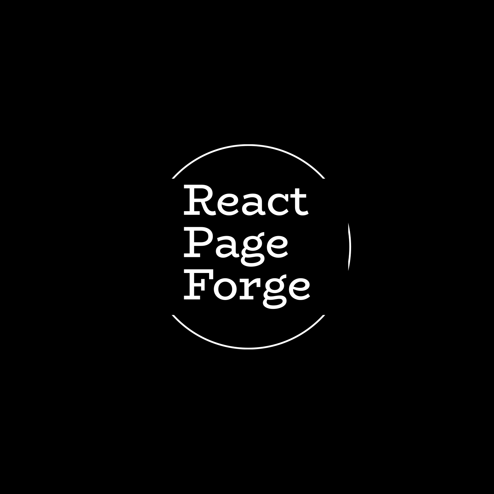

# React Page Forge

Greetings and welcome to React Page Forge! We're thrilled to have you here. As an open-source company dedicated to enhancing your web development experience, we specialize in providing top-notch page templates and user interfaces for your website needs.

Currently, we're in the exciting Alpha phase of our project, and your input is invaluable to us. We encourage you to explore our offerings and share your feedback and suggestions with us. Your insights will help us refine our code and deliver a polished product that streamlines the development process for countless developers.

Thank you for joining us on this journey. Together, let's shape the future of web development!

## Tech Stack

We are leveraging React as our foundational framework for the development of our user interface. Our objective is to craft UI elements and templates utilizing a comprehensive array of styling libraries at our disposal. Moreover, we remain open to insightful suggestions for enhancing our approach.

Our current considerations for styling libraries include:

1. **Tailwind CSS:** 
   - Status: Currently utilized in production.

2. **Styled Components:** 
   - Status: Release date pending.

3. **CSS:** 
   - Status: Release date pending.

We welcome any recommendations or ideas that align with our objectives and enhance the effectiveness of our UI development process.

